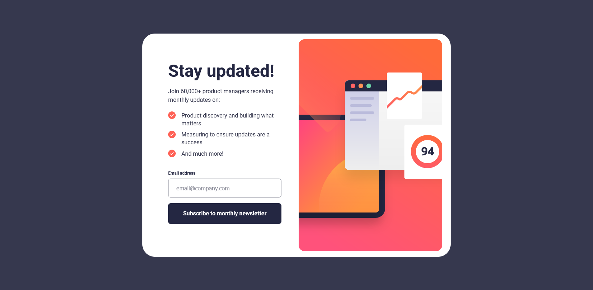

# Newsletter - Projeto Responsivo em React e CSS Puro

Bem-vindo ao repositório do projeto Newsletter! Este é um aplicativo web responsivo desenvolvido usando React e CSS puro para criar uma página de inscrição em uma newsletter. Além disso, incluímos uma imagem de demonstração para dar uma ideia visual do design em diferentes dispositivos.



## Funcionalidades

- Página de inscrição intuitiva para uma newsletter.
- Design responsivo criado com CSS puro para garantir uma experiência consistente em dispositivos de diferentes tamanhos.
- Utilização do React para facilitar a manipulação do DOM e o gerenciamento de estados.

## Como Usar

1. Certifique-se de ter o Node.js instalado em seu sistema.
2. Clone este repositório para o seu computador usando o seguinte comando:

```bash
git clone https://github.com/SEU_USUARIO/newsletter.git
```

1. Navegue até o diretório do projeto:

```bash
cd newsletter
```

1. Instale as dependências do projeto:

```bash
npm install
```

1. Inicie o servidor de desenvolvimento:

```bash
npm start
```

1. Abra o seu navegador e acesse http://localhost:3000 para ver a página de inscrição em ação em diferentes dispositivos.

2. Para iniciar o servidor backend na pasta service:

```bash
cd service
npm install
npm start
```

Agora, o servidor backend estará rodando em http://localhost:3001.

## Contribuição

Contribuições são bem-vindas! Se você encontrar algum problema ou tiver sugestões para melhorias, sinta-se à vontade para abrir uma issue ou enviar um pull request.

## Licença

Este projeto está licenciado sob a Licença MIT - veja o arquivo LICENSE para mais detalhes.

Esperamos que você goste de explorar e usar o projeto Newsletter. Sinta-se à vontade para personalizá-lo de acordo com suas necessidades ou aprender com o código para seus próprios projetos. Se tiver alguma dúvida, não hesite em entrar em contato.

Criado por PequenoJoohn.
